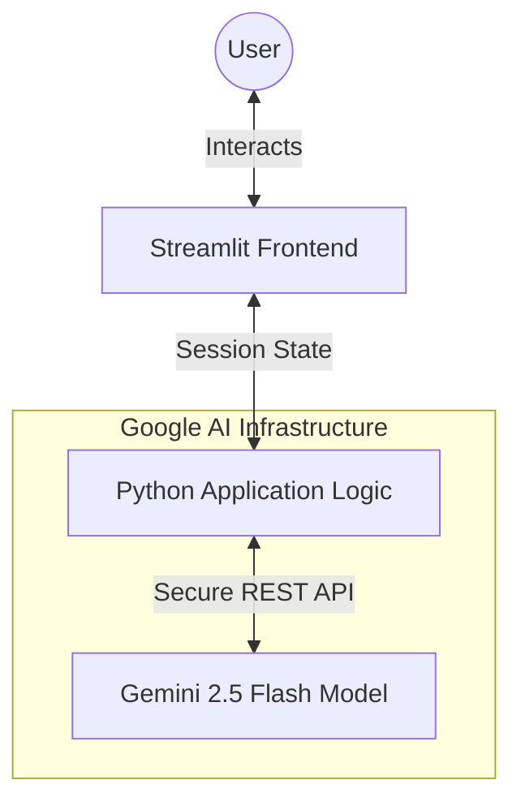
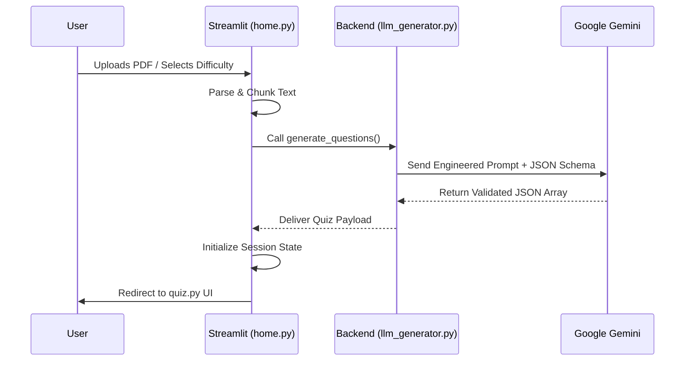

<div align="center">

# <span style="color: #FFB300;">SmartQuizzer 🚀</span>

### <span style="color: #FFB300;">*Integrated AI Synthesis & Cognitive Mastery Engine*</span>

---

**An End-to-End AI Ecosystem for Automated Content Synthesis and Cognitive Retention.**

</div>

---

### 📑 Table of Contents

* [🧠 Overview](https://www.google.com/search?q=%23-overview)
* [🎓 What Makes SmartQuizzer Different?](https://www.google.com/search?q=%23-what-makes-smartquizzer-different)
* [🎯 Core Philosophy](https://www.google.com/search?q=%23-core-philosophy)
* [✨ Key Features](https://www.google.com/search?q=%23-key-features)
* [🚀 Core Capabilities](https://www.google.com/search?q=%23-core-capabilities)
* [👥 Target Audience](https://www.google.com/search?q=%23-target-audience)
* [💻 Technology Stack](https://www.google.com/search?q=%23-technology-stack)
* [🏗️ System Architecture](https://www.google.com/search?q=%23-system-architecture)
* [🗺️ User Journey & Experience Map](https://www.google.com/search?q=%23-user-journey--experience-map)
* [🖥️ Screen-by-Screen Breakdown](https://www.google.com/search?q=%23-screen-by-screen-breakdown)
* [🏗️ Layout Component Architecture](https://www.google.com/search?q=%23-layout-component-architecture)
* [📊 Result Screen Breakdown](https://www.google.com/search?q=%23-result-screen-breakdown)
* [💻 Developer's Portal](https://www.google.com/search?q=%23-developers-portal)
* [🔮 Future Roadmap](https://www.google.com/search?q=%23-future-roadmap-the-path-to-v30)
* [🤝 Contributing](https://www.google.com/search?q=%23-contributing)
* [👥 Meet the Team](https://www.google.com/search?q=%23-meet-the-team)
* [📜 License](https://www.google.com/search?q=%23-license)

---

### 🧠 Overview

**SmartQuizzer** is an intelligent, AI-driven learning ecosystem designed to transform static educational content into dynamic, interactive assessments. It bridges the gap between passive reading and active recall by utilizing Google's state-of-the-art **Gemini 2.5 Flash** model to generate highly accurate, format-perfect quizzes directly from documents and raw text.

---

### 🎓 What Makes SmartQuizzer Different?

| Feature | Traditional Platforms | 🚀 SmartQuizzer |
| --- | --- | --- |
| **Content** | Pre-defined static question banks | Generated on-the-fly from your specific text/PDF |
| **Question Types** | Rigid single formats | Mixed formatting (MCQ, True/False, Fill-in-the-blank) |
| **Testing UI** | Linear flashcards | **Classic Exam Mode** (Free navigation & review) |
| **Deployment** | Heavy local installations | **Lightweight Containerization** (Docker ready) |

---

<div align="center">

## 🏛️ Core Philosophy

# <span style="color: #FFB300;">Synthesize. Retain. Master.</span>

*Eliminating the friction between information and intelligence.*

---

</div>

SmartQuizzer operates on three fundamental principles:

1. **🧠 Contextual Intelligence:** Questions are grounded strictly in the provided text, avoiding LLM hallucinations.
2. **💡 Structural Forcing:** Utilizing JSON-enforced prompting to guarantee predictable, crash-free user interfaces.
3. **🎯 Active Recall:** Shifting learners from passive reading to active, exam-style engagement.

---

### ✨ Key Features

| 🛠️ Feature | 📝 Description |
| --- | --- |
| **📄 Document-to-Quiz** | PDF extraction engine that pulls text from uploaded files and chunks it for AI processing. |
| **⚡ Smart Formatting** | Natively forces Gemini into JSON-mode to generate perfect distractors and answers. |
| **🧭 Exam Navigator** | A sidebar grid allowing users to skip, review, and jump between questions freely. |
| **⚖️ Dynamic Difficulty** | Granular control over the complexity of the generated questions. |
| **📊 Instant Grading** | Comprehensive end-of-quiz review screen showing accuracy metrics and correct answers. |
| **🎨 Native Theming** | Flawless integration with system Light/Dark modes, featuring a customized blue primary UI. |

---

## 🚀 Core Capabilities

| Capability | Technical Realization | Impact |
| --- | --- | --- |
| **Contextual Parsing** | Gemini 2.5 Flash LLM | Extracts core concepts from unstructured text with high accuracy. |
| **State Management** | Streamlit Session State | Preserves user selections, shuffled options, and navigation history securely. |
| **Format Enforcement** | `response_mime_type` | Mathematically locks the AI to output valid JSON, eliminating parsing crashes. |
| **Portability** | Docker Configuration | Runs identically on a local Mac, Google Cloud Run, or Render. |

---

## 👥 Target Audience

| User Group | Use Case | Primary Benefit |
| --- | --- | --- |
| **🎓 Students** | Exam Preparation | Rapid revision via active recall quizzes built from their own syllabus. |
| **👨‍🏫 Educators** | Material Generation | Reduces manual question-setting time by over 90%. |
| **💼 Professionals** | Skill Assessment | Quick validation of knowledge from technical whitepapers or corporate manuals. |

---

## 💻 Technology Stack

| Layer | Technology | Purpose |
| --- | --- | --- |
| **Frontend UI** |  | Building a responsive, interactive, and state-managed User Interface. |
| **Language** |  | Primary language for application logic and routing. |
| **AI Engine** |  | Ultra-fast inference for content generation and JSON structuring. |
| **DevOps** |  | Containerization for seamless cloud deployment. |

---

---

## 🏗️ System Architecture

SmartQuizzer utilizes a streamlined, server-rendered architecture optimized for high-speed AI inference and seamless state management.

### 📐 High-Level Architecture

This diagram illustrates the macro-interaction between the Streamlit Interface, the Python Backend, and the Google AI Cloud.



### 🔄 Request Flow Architecture

The step-by-step lifecycle of a single request, from user input to the final generated output.



---

## 🗺️ User Journey & Experience Map

SmartQuizzer is engineered to provide a frictionless path from raw information to total conceptual mastery.

| Stage | User Goal | System Touchpoint | Emotional State |
| --- | --- | --- | --- |
| **1. Ingestion** | Upload study material | Dashboard (home.py) | 📤 Hopeful |
| **2. Configuration** | Tailor the assessment | Settings Panel (Difficulty, Types) | ⚙️ In Control |
| **3. Processing** | Wait for AI results | Loading State (API Call) | ⏳ Anticipating |
| **4. Testing** | Answer questions freely | Quiz Arena (quiz.py) | 🧠 Focused |
| **5. Validation** | Submit and review | Final Grading Screen | 🎯 Confident |

---

## 🖥️ Screen-by-Screen Breakdown

Our interface is built on Streamlit's native component library, utilizing a custom primary theme color for a professional aesthetic.

| Screen Name | Core Functionality | Key UI Elements |
| --- | --- | --- |
| **🏠 Dashboard (`home.py`)** | Central input for materials | File Uploader, API Key input, Configuration Sliders. |
| **📝 Quiz Arena (`quiz.py`)** | Real-time assessment | Sidebar Grid Navigator, Radio buttons, Prev/Next controls. |
| **📊 Results Screen** | Performance visualization | Accuracy Metrics, Expandable answer reviews, Reset logic. |

---

## 🏗️ Layout Component Architecture

| Component | UI Role | Functionality & Logic |
| --- | --- | --- |
| **Sidebar Grid** | Navigation Rail | Dynamically generates buttons for each question. Shows `✅` for answered items and highlights the current view. |
| **Main Content** | Viewport Wrapper | Renders the active question, tags (Topic/Difficulty/Type), and shuffled radio options. |
| **Action Bar** | Contextual Footer | Floating controls for "Previous", "Next", and the final "Submit Quiz" action. |
| **State Cleaner** | Memory Management | Automatically purges `options_` and `answer_` variables when returning to the dashboard. |

---

## 📊 Result Screen Breakdown

The Result Screen serves as the "Post-Mortem" for the learning session, transforming raw inputs into a clean mastery report.

| Component | Technical Implementation | Purpose & User Impact |
| --- | --- | --- |
| **🏆 Performance Summary** | `st.metric` columns | Provides an immediate high-level overview of the final score and accuracy percentage. |
| **📝 Answer Review** | `st.expander` | Shows the user's input compared to the AI's correct answer for every single question. |
| **🚦 Status Indicators** | `st.success` / `st.error` | Color-codes the review sections so users can rapidly spot their mistakes. |
| **🔄 Quick Action Bar** | CTA Button | Safely wipes the session state and returns the user to the Dashboard for a new test. |

---

---

## 💻 Developer's Portal

This section provides the technical roadmap for setting up a local development environment for SmartQuizzer.

### 📋 Prerequisites

* **Python 3.10+**: For the core application.
* **Google Gemini API Key**: Obtainable for free from [Google AI Studio](https://www.google.com/search?q=https://aistudio.google.com/).
* **Docker** (Optional): If you intend to run the containerized version.

### 🛠️ Installation & Setup (Local)

1. **Clone the Project**
```bash
git clone https://github.com/yourusername/smartquizzer.git
cd smartquizzer

```


2. **Environment Configuration**
```bash
python -m venv env
source env/bin/activate  # Windows: env\Scripts\activate
pip install -r requirements.txt

```


3. **Theme Configuration**
Ensure your `.streamlit/config.toml` is set up for the custom UI:
```toml
[theme]
primaryColor = "#0066cc"
base = "dark"

```


4. **🚀 Launching the App**
```bash
streamlit run main.py

```


### 🐳 Docker Deployment

SmartQuizzer is fully containerized and production-ready.

1. **Build the Image**
```bash
docker build -t smartquizzer .

```


2. **Run the Container**
```bash
docker run -p 8501:8501 -e GEMINI_API_KEY="your_api_key_here" smartquizzer

```


---

## 🔮 Future Roadmap: The Path to v3.0

SmartQuizzer is continuously evolving. Below are the key milestones in our development pipeline:

* [ ] **Adaptive Scoring Engine:** Post-quiz logic that automatically calculates a new difficulty tier for the next study session based on accuracy.
* [ ] **Expert OCR (Image-to-Quiz):** Integrating vision models to convert physical textbooks and handwritten notes directly into structured JSON quizzes.
* [ ] **Mnemonic & ELI10 Hub:** A dedicated dashboard for generating AI-crafted memory stories, acronyms, and "Explain Like I'm 10" analogies for failed questions.
* [ ] **Database Integration:** Moving beyond Session State to a persistent SQLite/PostgreSQL database to track user learning curves over months.

---

## 🤝 Contributing

Contributions are what make the open-source community such an amazing place to learn, inspire, and create. Any contributions you make are **greatly appreciated**.

1. Fork the Project
2. Create your Feature Branch (`git checkout -b feature/AmazingFeature`)
3. Commit your Changes (`git commit -m 'Add some AmazingFeature'`)
4. Push to the Branch (`git push origin feature/AmazingFeature`)
5. Open a Pull Request

---

## 👥 Meet the Team

SmartQuizzer was architected and developed by **Sarvesh**, an AI Engineer and Data Science researcher specializing in applied machine learning, distributed ML, and generative AI ecosystems.

---

## 📜 License

Distributed under the MIT License. See `LICENSE` for more information.